# Florida Holiday Chooser

This site is for the user to be able to create a holiday package based on the users criteria of city, type of accomidation, price of accomidation, and things to do in an area.

## Table of contents

- [User-stories](#user-stories)
- [Wireframes](#wireframes)
- [Technologies-used](#technologies-used)
- [Testing](#testing)
- [Deployment](#deployment)
- [License](#license)

## User stories

### User story 1:

I want a simple site where I easily can see suggestions of nice cities in Florida where I can vaccation and get suggestions of things to do.

### User story 2:

I would like a site where I can create a holiday package based on my choice of city, hotel and price.

## Wireframes

#### - Phone

<table>
  <tr>
    <td align="center" valign="top">
      <h4>Landing page:</h4>
      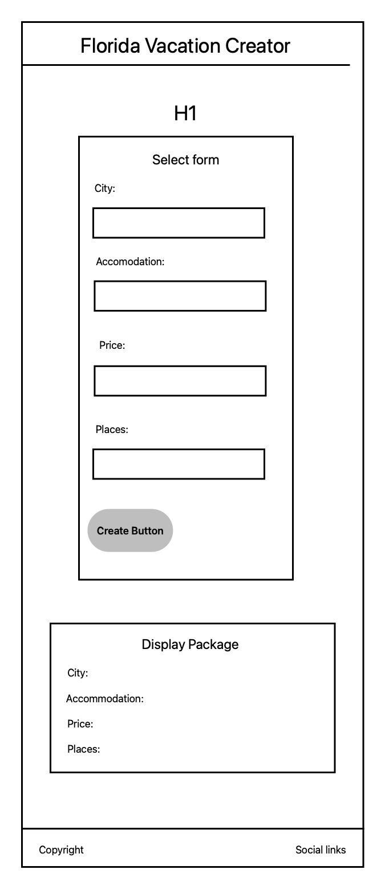
    </td>
  </tr>
</table>

#### Tablet

<table>
  <tr>
    <td align="center" valign="top">
      <h4>Landing page:</h4>
      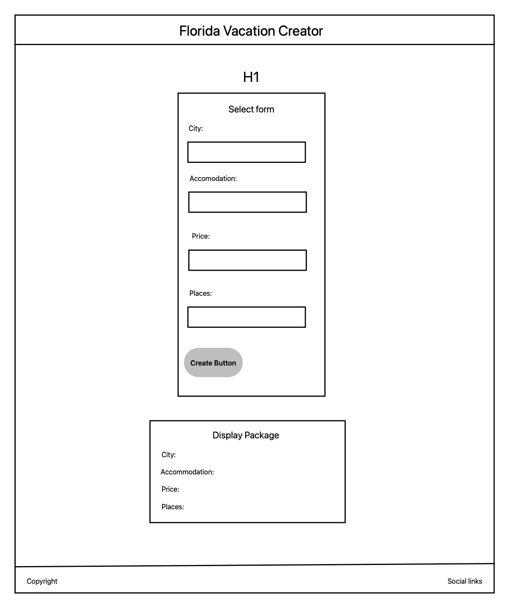
    </td>
  </tr>
</table>

#### Desktop:

<table>
  <tr>
    <td align="center" valign="top">
      <h4>Landing page:</h4>
      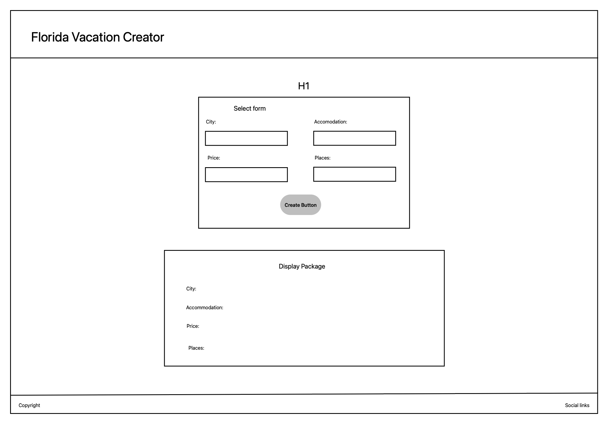
    </td>
  </tr>
</table>

## Technologies used

The following technologies were utilized in the development of this website:

Frontend

• HTML5: For structuring content and semantic elements.
• CSS3: For styling, animations, and layout designs.
• Includes responsive design using Flexbox and CSS Grid.
• Javascript for running functions for interactive components
• Bootstrap 5: For pre-built responsive components, grid system, and utility classes.

Version Control

• Git: For version tracking and collaboration.
• GitHub: For repository hosting, issue tracking, and deployment.

Deployment

• GitHub Pages: For hosting and deploying the website (static sites).

Testing

• Lighthouse: For performance, accessibility, SEO, and best practices auditing.
• W3C Validator: For validating HTML and CSS compliance.
• JSHint: For Javascript validation

Additional Tools

• Font Awesome: For adding scalable icons to the website.
• Google Fonts: For custom typography.

## Testing

### Code validation

#### HTML

I've used the <a href="https://validator.w3.org">HTML W3C Validator</a> to validate all of my HTML files.

<table>
  <tr>
    <td align="center" valign="top">
      <h4>Page</h4>
      
Landing page

    </td>
     <td align="center" valign="top">
      <h4>W3C URL</h4>
      <a href="https://validator.w3.org">
W3C
</a>
    </td>
     <td align="center" valign="top">
      <h4>Screenshot</h4>
       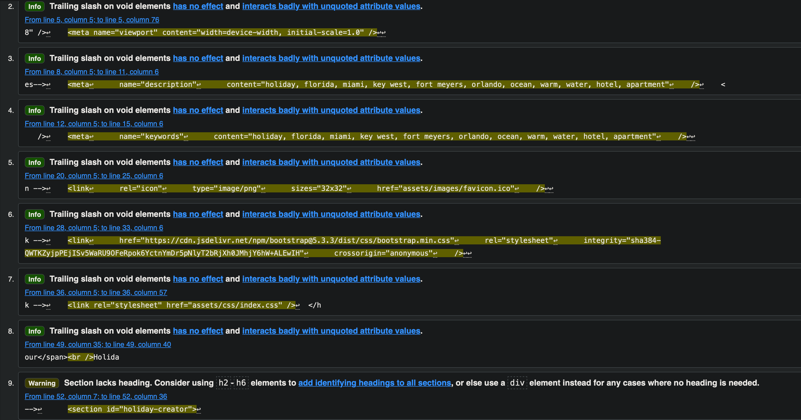
    </td>
     <td align="center" valign="top">
      <h4>Notes</h4>
      
Info: "Trailing slash on void elements", is just Prettier formating not being liked.  Warning: Just a Heading not really needed.

    </td>
  </tr>
</table>

#### CSS

I've used the <a href="https://jigsaw.w3.org/css-validator/">CSS W3C Validator</a> to validate all of my CSS files.

<table>
  <tr>
    <td align="center" valign="top">
      <h4>Page</h4>
      
Landing page

    </td>
     <td align="center" valign="top">
      <h4>W3C URL</h4>
      <a href="https://jigsaw.w3.org/css-validator/">
W3C
</a>
    </td>
     <td align="center" valign="top">
      <h4>Screenshot</h4>
       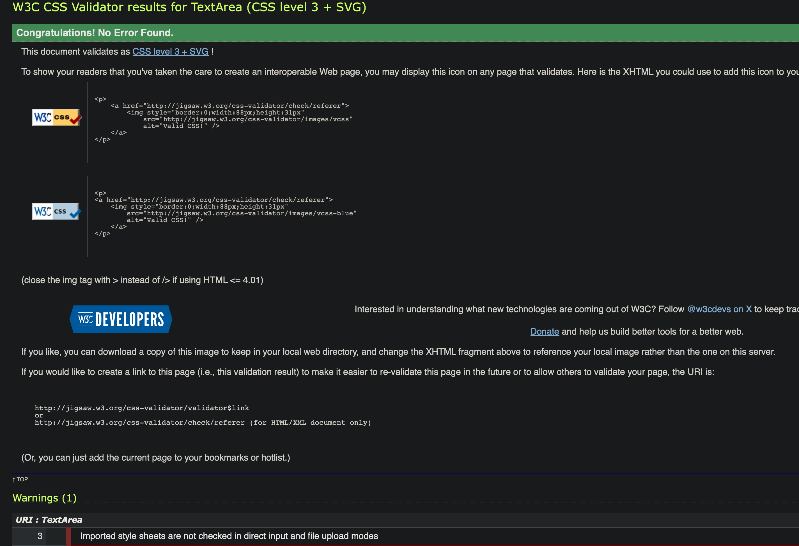
    </td>
     <td align="center" valign="top">
      <h4>Notes</h4>
      
Pass: No errors. Warning: Nothing that impacts the CSS

    </td>
  </tr>
</table>

#### Javascript

I've used <a href="https://jshint.com">JSHint</a> to validate all of my JS files.

<table>
  <tr>
    <td align="center" valign="top">
      <h4>Page</h4>
      
Landing page

    </td>
     <td align="center" valign="top">
      <h4>JSHint URL</h4>
      <a href="https://jshint.com">
JSHint
</a>
    </td>
     <td align="center" valign="top">
      <h4>Screenshot</h4>
       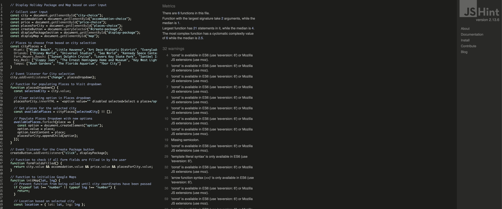
    </td>
     <td align="center" valign="top">
      <h4>Notes</h4>
      
No errors

    </td>
  </tr>
</table>

#### Lighthouse Audit

<table>
  <tr>
    <td align="center" valign="top">
      <h4>Page</h4>
      
Landing page

    </td>
    <td align="center" valign="top">
      <h4>Size</h4>
      
Mobile
    </td>
     <td align="center" valign="top">
      <h4>Screenshot</h4>
      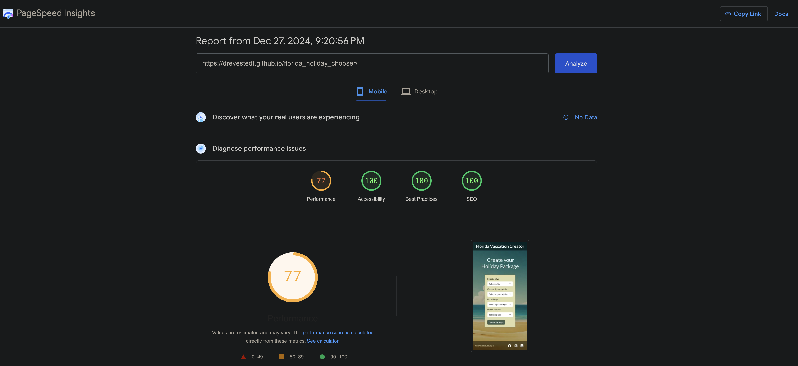
    </td>
     <td align="center" valign="top">
      <h4>Notes</h4>
      
No major warnings

    </td>
  </tr>

  <tr>
    <td align="center" valign="top">
      <h4>Page</h4>
      
Landing page

    </td>
    <td align="center" valign="top">
      <h4>Size</h4>
      
Desktop
    </td>
     <td align="center" valign="top">
      <h4>Screenshot</h4>
      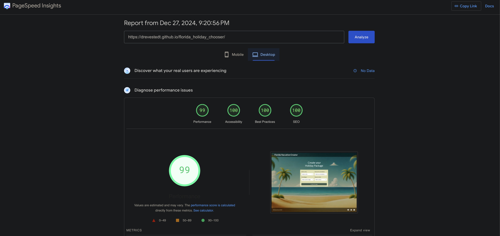
    </td>
     <td align="center" valign="top">
      <h4>Notes</h4>
      
Almost perfect

    </td>
  </tr>
</table>

## Deployment

### Browser Compatibility

I've tested my deployed project on multiple browsers to check for compatibility issues.

<table>
  <tr>
    <td align="center" valign="top">
      <h4>Browser</h4>
      
Safari

    </td>
     <td align="center" valign="top">
      <h4>Screenshot</h4>
       
    </td>
  </tr>
   <tr>
    <td align="center" valign="top">
      
Brave

    </td>
     <td align="center" valign="top">
       
    </td>
  </tr>
  <tr>
    <td align="center" valign="top">
      
Firefox

    </td>
     <td align="center" valign="top">
       
    </td>
  </tr>
</table>

### Responsiveness

I've tested my deployed project on multiple devices to check for responsivness issues.

<table>
<tr>
    <td align="center" valign="top">
      <h4>Device</h4>
      
Mobile (Dev Tools)

    </td>
     <td align="center" valign="top">
      <h4>Screenshot</h4>
       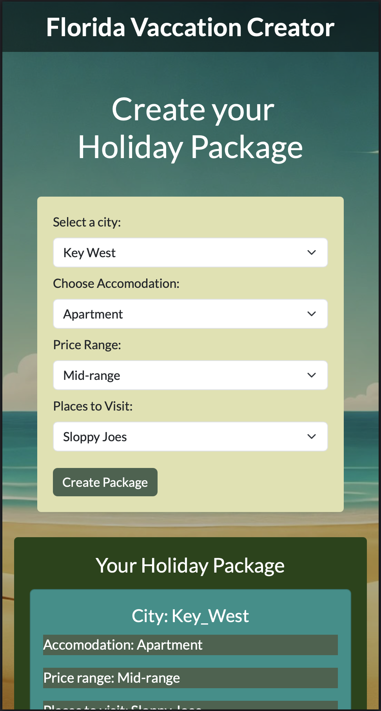
    </td>
  </tr>
  <tr>
   <td align="center" valign="top">
      
Tablet (Dev Tools)

    </td>
     <td align="center" valign="top">
       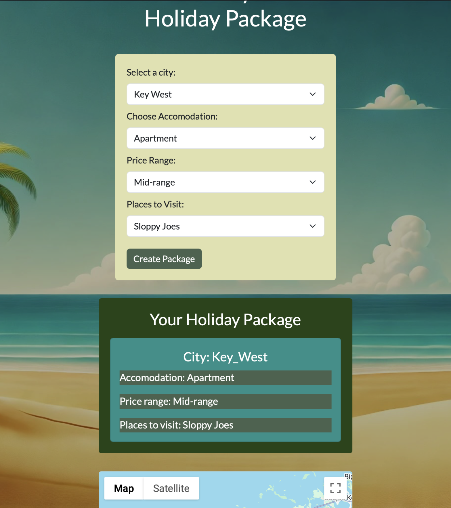
    </td>
  </tr>
  <tr>
   <td align="center" valign="top">
      
Desktop

    </td>
     <td align="center" valign="top">
       
    </td>
  </tr>
  <tr>
   <td align="center" valign="top">
      
iPhone 14 Pro

    </td>
     <td align="center" valign="top">
       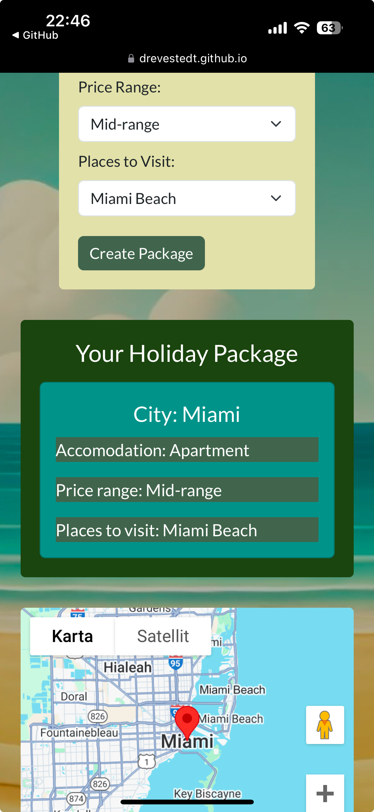
    </td>
  </tr>
  <tr>
   <td align="center" valign="top">
      
iPad Pro 13"

    </td>
     <td align="center" valign="top">
       
    </td>
  </tr>
</table>

## License

This project is licensed under the MIT License. You are free to use, copy, modify, merge, publish, distribute, sublicense, or sell copies of the Software, provided proper credit is given to the author.

### MIT License

Permission is hereby granted, free of charge, to any person obtaining a copy
of this software and associated documentation files (the "Software"), to deal
in the Software without restriction, including without limitation the rights
to use, copy, modify, merge, publish, distribute, sublicense, and/or sell
copies of the Software, and to permit persons to whom the Software is
furnished to do so, subject to the following conditions:

The above copyright notice and this permission notice shall be included in all
copies or substantial portions of the Software.

THE SOFTWARE IS PROVIDED "AS IS", WITHOUT WARRANTY OF ANY KIND, EXPRESS OR
IMPLIED, INCLUDING BUT NOT LIMITED TO THE WARRANTIES OF MERCHANTABILITY,
FITNESS FOR A PARTICULAR PURPOSE AND NONINFRINGEMENT. IN NO EVENT SHALL THE
AUTHORS OR COPYRIGHT HOLDERS BE LIABLE FOR ANY CLAIM, DAMAGES OR OTHER
LIABILITY, WHETHER IN AN ACTION OF CONTRACT, TORT OR OTHERWISE, ARISING FROM,
OUT OF OR IN CONNECTION WITH THE SOFTWARE OR THE USE OR OTHER DEALINGS IN THE
SOFTWARE.
